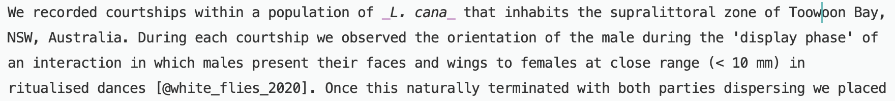
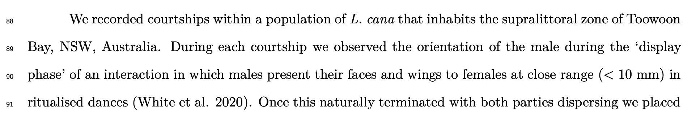

```{r setup, include=FALSE}
knitr::opts_chunk$set(echo = FALSE)
```

## R Markdown = R + Markdown

R markdown combines **R** with **Markdown** into a flexible tool for creating reproducible, dynamic documents. So wherever you need to combine code or its output with text, then R Markdown might be worth considering. Example use-cases include:

## R Markdown = R + Markdown

R markdown combines **R** with **Markdown** into a flexible tool for creating reproducible, dynamic documents. So wherever you need to combine code or its output with text, then R Markdown might be worth considering. Example use-cases include:

- Writing a scientific paper (wouldn't recommend as a _first_ exercise, but perfectly doable)
- Writing a technical document or whatever it is people do outside of academia
- 'Thinking out loud' with/for collaborators (do this a fair bit) 
- Creating slides (like these ones!) or webpages

## R Markdown = R + Markdown

Benefits include:

## R Markdown = R + Markdown

Benefits include:

- Allows x-treme reproducibility
- Prevent transcription errors since you move directly from `data -> code -> document`
- Easily updateable documents. Just tweak/add the code and all the downstream numbers etc. will follow 
- Use one tool for everything. Data wrangling, visualisation, analysis, writing
- Many output formats from one file. `.pdf`, `.docx`, `.html` for use as documents, website pages, slides
- Plays well with version control (git + github)

## R Markdown = R + Markdown

Downsides:

## R Markdown = R + Markdown

Downsides:

- Learning curve, as with all things
- Limited commenting
  - But you can mark up & comment pdf's
  - Or if collaborators also use github there are commenting/review tools on there, no worries
- Journals and/or collaborators inevitably require a word doc at some stage

## What is R?

The programming language we all love to love that only makes our lives easier in every way and never more frustrating or difficult or fiddly or infuriating. It looks like this:

```{r code_example, echo=TRUE, eval=FALSE}
# Here is some nicely commented code

## Load some data
my_dat <- read.csv('../data/example_data.csv')

## Inspect the data
str(my_dat)

```

## What is Markdown?

>- Markdown is a _plain-text markup language_
>- Unlike Word and other What You See is What You Get (WYSIWYG) editors, markdown separates the *content* of a document from its *formatting* 
>- This means that the same content can be spun into a variety of different formats and styles (html, pdf's, slides, even word docs now), just by tweaking some instructions on how it should be used 
>- So it's just simple old plain text, but with a few special characters to describe how you would like your text formatted in the final output
>- Takes 5 minutes to learn

## What is Markdown?

This is markdown. Markdown is just text. Here's an exceprt from a recent manuscript written in markdown, in my preferred text editor: 

{width=900px,}
\  

which gives

## What is Markdown?

This is markdown. Markdown is just text. Here's an exceprt from a recent manuscript written in markdown, in my preferred text editor: 

{width=900px,}
\  

which gives

{width=900px,}

## What is Markdown?

And if you want to add some basic formatting, there are just a handful of tricks to remember (also see cheatsheet):

>- \*\*bold\*\* or \_\_bold\_\_ creates **bold**
>- \*italic\* \_italic\_ creates _italics_
>- \^superscript\^ is ^superscript^
>- A fancy equation writen like this \$\\sqrt[n]{k^3}\$ makes $\sqrt[n]{k^3}$

## So what is R Markdown?

It allows us to combine both R and Markdown to weave code and/or **its output** and text into a single document. You include text just by writing like this. Blah blah blah. You can include code and/or its results in two ways. One is via code **chunks** that look like this:

## Code-chunk example

```{r, echo = TRUE}
# Fake some data properly
spider_colony_a <- rnorm(97, 44, 13)
spider_colony_b <- rnorm(115, 56, 18)

t.test(spider_colony_a, spider_colony_b)  # Publish!
```

## In-line example

The other way to include code is inline, which replaces text with output. For example, let's round $\pi$ to two decimals by including this bit of code
```{r, eval = FALSE, echo=TRUE}
`r round(pi, 2)`
```  
Which gives:

  - `r round(pi, 2)`
  
## In-line example

We can use that trick when writing documents, so that the output is automatically slotted into place in the text. So for example this:

  >- White (2020) suggests that pi is equal to `\r round(pi, 2)`, but I call bs. 

>when rendered (to pdf, docx, whatever), becomes this:

  >- White (2020) suggests that pi is equal to `r round(pi, 2)`, but I call bs. 

## Other stuff

### Output formats:

  - HTML - for the internets
  - PDF - for manuscripts/reports (requires installing `latex`)
  - Word - for editing with non-R people, journals
  - Several slide formats - for presentations 

### Bibliographies

  - Using 'BibTeX'
  - Output in whatever journal style by updating a template
  
But let's go interactive...


